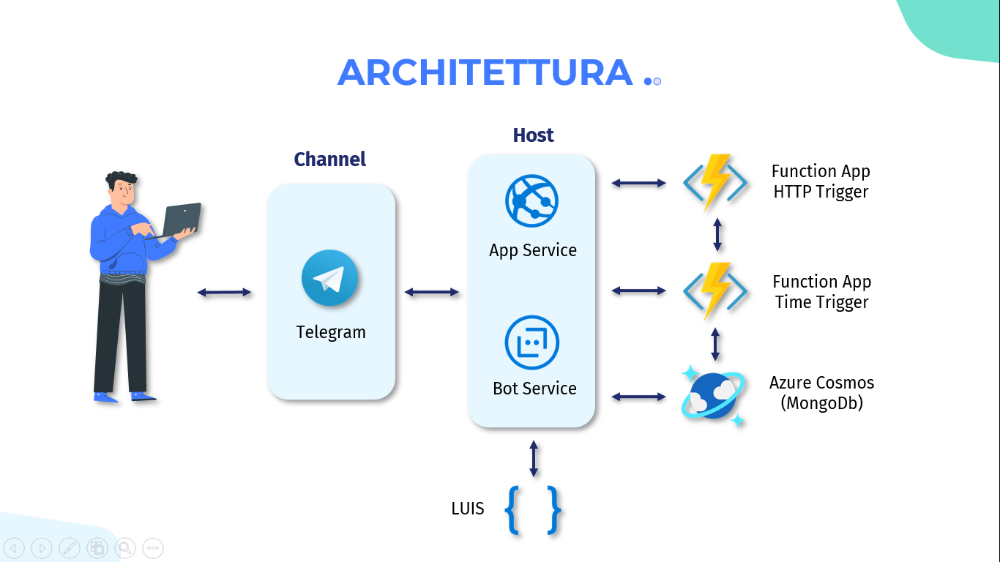
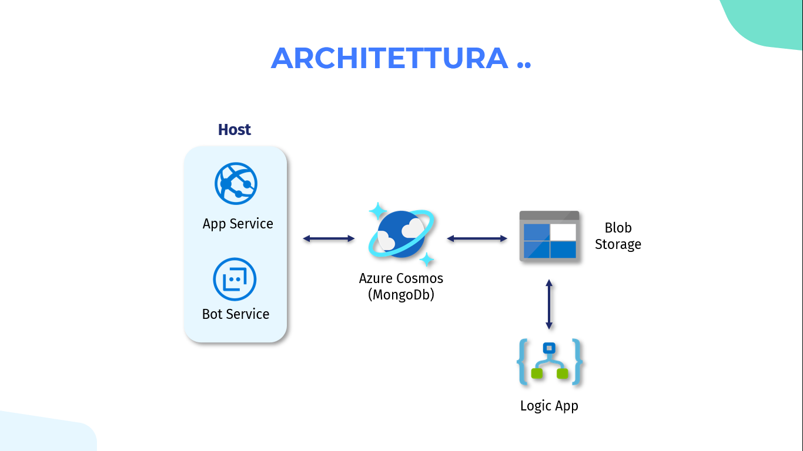

# MyHealthcareBot 🤖

## Descrizione

A seguito dell’emergenza sanitaria causata dal coronavirus, il governo e le autorità sanitarie hanno
disposto misure restrittive a tutta la popolazione, stabilendo il divieto di assembramenti e il
mantenimento di distanze di sicurezza. In un periodo come questo, dove l’epidemia dilaga, sarebbe
importante soprattutto all’interno delle strutture sanitarie, oltre ad indossare la mascherina e a
disinfettare frequentemente le mani, garantire il corretto distanziamento di personale medico e
pazienti. 

Per permettere tutto ciò fondamentale è l’organizzazione, in maniera tale da differenziare
gli appuntamenti per orario ed evitare così le code. La soluzione è quella di realizzare un bot che
fornisca supporto alle strutture sanitarie, così da gestire in maniera efficiente le prenotazioni di
visite mediche da parte dei pazienti e organizzandole in diverse fasce orarie. 
***

## Idea
L’idea è stata quella di sviluppare MyHealthcarebot fornendo all’utente diverse importanti funzionalità, tra cui:

• **Informazioni sulle strutture Sanitarie**: Il paziente ha la possibilità di chiedere al bot informazioni su una specifica struttura e ottenere tutte le informazioni di cui necessita.

• **Informazioni sui Dottori**: Il paziente ha la possibilità di chiedere informazioni relative ai dottori appartenenti ad una certa struttura sanitaria, questo al fine di avere un quadro generale chiaro per poi poter effetturare delle prenotazioni.

• **Prenotazione Visita**: Il paziente, conoscendo le strutture sanitarie, i dottori e le patologie da loro trattate, ha la possibilità di prenotare uno slot orario di una visita specialistica tra quelli messi a disposizione.

• **Area Admin**: L’amministratore della struttura sanitaria ha a disposizione un’area riservata, accessibile solo dopo essersi autenticato con le credenziali che gli sono state fornite dalla struttura stessa. Una volta autenticato, l’amministratore può visualizzare le prenotazioni fatte dai pazienti della struttura oppure annullare le visite dei dottori.

***
## Architettura
L’architettura di MyHealtcareBot è caratterizzata dall’utilizzo di diversi servizi:

• **Azure App Service**: Un servizio utilizzato non solo per ospitare il bot, ma soprattutto per ospitare l’app web necessaria per l’autenticazione dell’amministratore di struttura. Permette di creare e distribuire rapidamente le app, tramite la possibilità di utilizzare uno dei tanti linguaggi di programmazione supportati, in questo caso Node.js, garantendo affidabilità, alte prestazioni e bilanciamento del carico.

• **Azure Bot service**: Questo servizio è essenziale per la creazione del bot, poichè ne consente lo sviluppo rapido e intelligente basato su Microsoft Bot framework, il tutto eseguito in un ambiente serverless su Azure. Permette di creare, gestire e connettere il bot interagendo in maniera naturale con I pazienti. Il canale scelto per consentire ai pazienti di comunicare con il bot è telegram, principalmente per la sua facilità d’uso e la per sua popolarità.

• **LUIS**: Un servizio di intelligenza artificiale con lo scopo di applicare tecniche di machine learning a conversazioni in linguaggio naturale in modo da poter capire gli obiettivi dell’utente. LUIS permette allo sviluppatore di creare un modello linguistico caratterizzato da esempi di possibili domande che possono essere poste dai pazienti, al fine di interpretare correttamente le domande e quindi estrarre le informazioni richieste.

• **Azure Function**: Fondamentale per l’invio delle e-mail e per l’aggiornamento dei dati all’interno del database. Azure Function offre funzionalità di calcolo serverless che permette allo sviluppatore di scrivere meno codice, gestire un’infrastruttura meno complessa e risparmiare sui costi. Per MyHealthcareBot si è pensato di utilizzare un Http Trigger. In questo modo la funzione viene eseguita al momento della conferma della prenotazione, in cui le informazioni inserite dal paziente vengono elaborate dalla funzione stessa, la quale si occupa dell’invio della relativa e-mail. Oltre ad un Http Trigger è stato utilizzato un Timer trigger per eseguire la funzione in maniera schedulata, garantendo il corretto aggiornamento delle informazioni all’interno del database (in particolare le date delle visite)a un intervallo di tempo specificato.

• **Azure Cosmos Database**: Si tratta di un database NoSQL caratterizzato da tempi di risposta in millisecondi e scalabilità automatica ed immediata, garantendo una velocità ottimale su larga scala e scalabilità delle risorse di archiviazione. Grazie all’utilizzo dell’API per MongoDB, sono state create diverse collezioni, ognuna relativa ad un certo contesto, tra cui: dottori, amministratori, prenotazioni e strutture sanitarie. Questo ha permesso di poter richiedere le informazioni dei record presenti all’interno delle collezioni semplicemente effettuando delle query lato codice, quindi eseguendo rapidamente operazioni di lettura e scrittura. Alcune delle operazioni svolte dal bot, come l’accesso alle informazioni di un dottore, il login dell’amministratore e le prenotazioni delle visite sono possibili solo grazie a specifiche query che permettono di ottenere tutte le informazioni richieste.

• **Blob Storage**: Tale servizio è stato utilizzato per l’archiviazione dei QR-code, i quali vengono generati e archiviati sottoforma di immagini.

• **Azure Logic App**: A causa dell’elevato numero di prenotazioni e di conseguenza dell’elevato numero di immagini archiviate, si è pensato di usufruire di un servizio che ne permettesse l’eliminazione dopo un certo periodo di tempo, ottimizzando così lo spazio di archiviazione. Azure Logic App è una piattaforma per la creazione e l’esecuzione di flussi di lavoro automatizzati, garantendo soluzioni altamente scalabili. Per poter eliminare le immagini archiviate è stato necessario progettare la Logic app in modo da rendere il processo del tutto automatizzato. Si è partito dalla sua ricorrenza di attivazione, in questo caso specificando l’orario e un giorno della settimana in cui la Logic app deve essere eseguita, poi è stata creata una connessione API, che ha consentito di connettere la Logic app al servizio di archiviazione BlobStorage, in particolare alla cartella public contenente le immagini da eliminare.
altamente scalabili. Per poter eliminare le immagini archiviate è stato necessario progettare la Logic app in modo da rendere il processo del tutto automatizzato. Si è partito dalla sua ricorrenza
